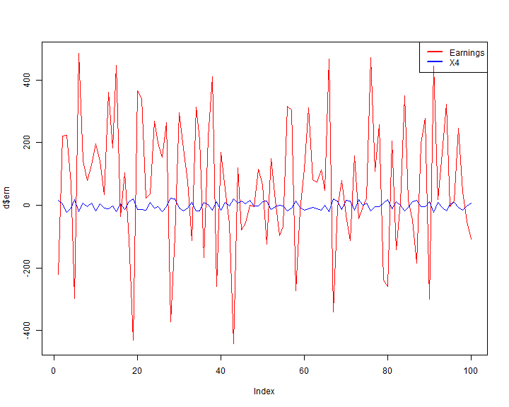
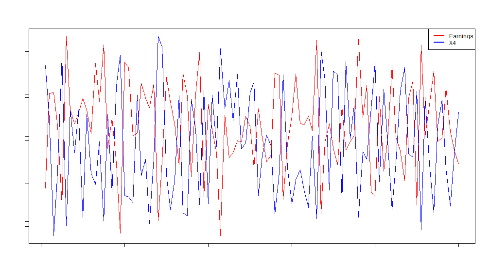
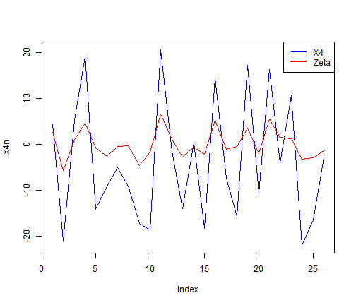
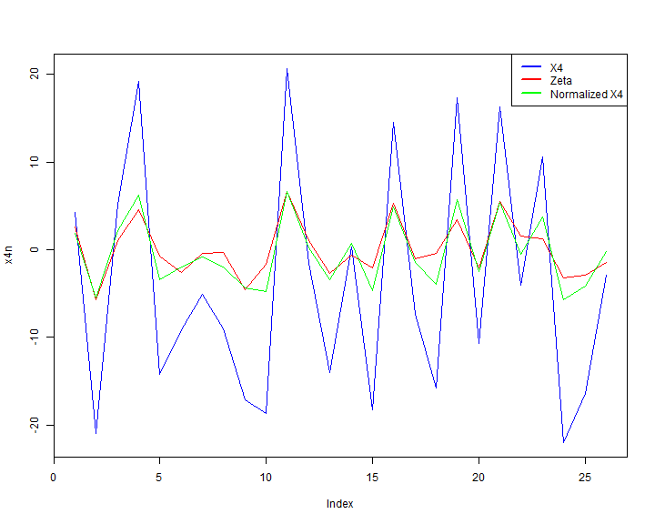

AdSquare Data Teaser Analysis
========================================================

This analysis will try to find correlation between data collected and stored in a JSON file. The object contains index variable {0:99}, that's the 
number of observations collected are 100, and there are 5 collected variables: {x1,x2,x3,x4,x5}, an Earnings variable asscoiated for each observation and a Zeta variable which has NA values.


```r
library('rjson')
library('psych')
library('Hmisc')
```

```
## Loading required package: grid
## Loading required package: lattice
## Loading required package: survival
## Loading required package: splines
## Loading required package: Formula
## 
## Attaching package: 'Hmisc'
## 
## The following object is masked from 'package:psych':
## 
##     describe
## 
## The following objects are masked from 'package:base':
## 
##     format.pval, round.POSIXt, trunc.POSIXt, units
```

```r
file <- 'adsquare_teaser_dataMay2014.json'
data <- fromJSON(paste(readLines(file), collapse=""))

x1 <- data[[2]]
x2 <- data[[3]]
x3 <- data[[4]]
x4 <- data[[5]]
x5 <- data[[6]]
ern <- data[[7]]
z <- data[[8]]

x1 = sapply(seq(100), function(i) x1[[i]])
x2 = sapply(seq(100), function(i) x2[[i]])
x3 = sapply(seq(100), function(i) x3[[i]])
x4 = sapply(seq(100), function(i) x4[[i]])
x5 = sapply(seq(100), function(i) x5[[i]])
ern = sapply(seq(100), function(i) ern[[i]])

z <- sapply(seq(100), function(i) z[[i]])

z <- lapply(z, as.numeric)
z <- as.numeric(z)


d = data.frame(x1,x2,x3,x4,x5, z, ern)

summary(d)
```

```
##        x1              x2               x3               x4        
##  Min.   :-2.87   Min.   :-13.62   Min.   :-1.910   Min.   :-23.27  
##  1st Qu.: 6.17   1st Qu.: -3.37   1st Qu.:-0.202   1st Qu.:-12.70  
##  Median :11.11   Median :  2.06   Median : 1.237   Median : -2.90  
##  Mean   :11.04   Mean   :  3.43   Mean   : 1.067   Mean   : -1.62  
##  3rd Qu.:16.33   3rd Qu.: 11.56   3rd Qu.: 2.064   3rd Qu.:  9.63  
##  Max.   :23.84   Max.   : 23.38   Max.   : 5.298   Max.   : 23.53  
##                                                                    
##        x5                z              ern        
##  Min.   :-16.501   Min.   :-5.74   Min.   :-441.9  
##  1st Qu.:  0.452   1st Qu.:-2.12   1st Qu.: -53.4  
##  Median :  7.079   Median :-0.53   Median :  71.8  
##  Mean   :  6.666   Mean   : 0.01   Mean   :  69.0  
##  3rd Qu.: 12.921   3rd Qu.: 1.48   3rd Qu.: 206.2  
##  Max.   : 24.826   Max.   : 6.65   Max.   : 485.6  
##                    NA's   :74
```
## Q1 Can you find any relation between one or more of the input columns {X1, X2, X3, X4, X5} and the ‘Earnings’ of the company?
I used the rcorr function to get more rigid analysis of correlation by also checking the P-Values:

```r
rcorr(as.matrix(d), type="pearson")
```

```
##        x1    x2    x3    x4    x5     z   ern
## x1   1.00 -0.11  0.16 -0.06  0.07  0.28  0.05
## x2  -0.11  1.00 -0.03 -0.05 -0.12 -0.20  0.24
## x3   0.16 -0.03  1.00  0.07 -0.15 -0.08 -0.01
## x4  -0.06 -0.05  0.07  1.00 -0.05  0.91 -0.80
## x5   0.07 -0.12 -0.15 -0.05  1.00  0.22  0.12
## z    0.28 -0.20 -0.08  0.91  0.22  1.00 -0.76
## ern  0.05  0.24 -0.01 -0.80  0.12 -0.76  1.00
## 
## n
##      x1  x2  x3  x4  x5   z ern
## x1  100 100 100 100 100  26 100
## x2  100 100 100 100 100  26 100
## x3  100 100 100 100 100  26 100
## x4  100 100 100 100 100  26 100
## x5  100 100 100 100 100  26 100
## z    26  26  26  26  26 100  26
## ern 100 100 100 100 100  26 100
## 
## P
##     x1     x2     x3     x4     x5     z      ern   
## x1         0.2835 0.1038 0.5708 0.5026 0.1587 0.6052
## x2  0.2835        0.7333 0.5880 0.2348 0.3351 0.0140
## x3  0.1038 0.7333        0.4858 0.1387 0.6883 0.8837
## x4  0.5708 0.5880 0.4858        0.6421 0.0000 0.0000
## x5  0.5026 0.2348 0.1387 0.6421        0.2887 0.2169
## z   0.1587 0.3351 0.6883 0.0000 0.2887        0.0000
## ern 0.6052 0.0140 0.8837 0.0000 0.2169 0.0000
```

```r
rcorr(as.matrix(d), type="spearman")
```

```
##        x1    x2    x3    x4    x5     z   ern
## x1   1.00 -0.10  0.19 -0.05  0.09  0.26  0.06
## x2  -0.10  1.00 -0.04 -0.05 -0.08 -0.15  0.24
## x3   0.19 -0.04  1.00  0.06 -0.14 -0.12 -0.03
## x4  -0.05 -0.05  0.06  1.00 -0.06  0.89 -0.81
## x5   0.09 -0.08 -0.14 -0.06  1.00  0.23  0.14
## z    0.26 -0.15 -0.12  0.89  0.23  1.00 -0.63
## ern  0.06  0.24 -0.03 -0.81  0.14 -0.63  1.00
## 
## n
##      x1  x2  x3  x4  x5   z ern
## x1  100 100 100 100 100  26 100
## x2  100 100 100 100 100  26 100
## x3  100 100 100 100 100  26 100
## x4  100 100 100 100 100  26 100
## x5  100 100 100 100 100  26 100
## z    26  26  26  26  26 100  26
## ern 100 100 100 100 100  26 100
## 
## P
##     x1     x2     x3     x4     x5     z      ern   
## x1         0.2993 0.0598 0.6274 0.3496 0.2042 0.5342
## x2  0.2993        0.7035 0.6010 0.4473 0.4520 0.0166
## x3  0.0598 0.7035        0.5647 0.1766 0.5683 0.7551
## x4  0.6274 0.6010 0.5647        0.5866 0.0000 0.0000
## x5  0.3496 0.4473 0.1766 0.5866        0.2495 0.1769
## z   0.2042 0.4520 0.5683 0.0000 0.2495        0.0006
## ern 0.5342 0.0166 0.7551 0.0000 0.1769 0.0006
```
The most significant correlation is X4~Earnings with negative monotonic and linear correlation ~= -0.8

## Q2 Describe briefly the algorithm you used to answer (1), and justify how good your answer is?
As calculated the X4 is the most correlated variable with Earnings, the correlation is negatively linear -0.8, and with P-Value at the minimum 0.00, which refutes the null hyposis and supports the significance of the correlation.

## Q3 Can you plot this data in a way that helps understand the relationship between one or more of {X1, X2, X3, X4, X5}, against ‘Earnings’?


```r
plot(d$ern, type='l', col="red")

lines(d$x4, type='l', col="blue")
legend("topright", c("Earnings","X4"), lty=c(1,1),lwd=c(2.5,2.5),col=c("red","blue"))
```

 
In a normalized plot, the negative correlation will appear better:

```r
plot(d$ern, type='l', col="red", ylab='', xlab='', labels = FALSE)
par(new=T)
plot(d$x4, type='l', col="blue", ylab='', xlab='', labels = FALSE)
legend("topright", c("Earnings","X4"), lty=c(1,1),lwd=c(2.5,2.5),col=c("red","blue"))
```

 
## Q5 How do you think the Zeta column is dependent on the {X1, X2, X3, X4, X5} ? Describe your approach briefly.
Checking the correlation values of Zeta and other variables, I found that X4 also is the most correlated variable with positve correlation = 0.91, this plot will show it: 

```r
zn = z[!is.na(z)]
x4n  = x4[!is.na(z)]

plot(x4n, col="blue", type='l')
lines(zn, col="red", type='l')
legend("topright", c("X4","Zeta"), lty=c(1,1),lwd=c(2.5,2.5),col=c("blue","red"))
```

 

## Q4 Can you extract any intelligence from the data set to predict the missing ‘Zeta’ values?

I used a normalization technique to get the values of Zeta from X4, where the missing value of Zeta can be got by normalizing X4 between [Min(Zeta), Max(Zeta)]


```r
mnX4n = min(x4n)
mxX4n = max(x4n)
mnZn = min(zn)
mxZn = max(zn)
calcZ <- function(xn)(((xn - mnX4n)* (mxZn - mnZn))/ (mxX4n - mnX4n))+mnZn
plot(x4n, col="blue", type='l')
lines(zn, col="red", type='l', ylab='', xlab='', labels = FALSE)


lines(calcZ(x4n), col="green", type='l', ylab='', xlab='', labels = FALSE)
legend("topright", c("X4","Zeta", "Normalized X4"), lty=c(1,1),lwd=c(2.5,2.5),col=c("blue","red", "green"))
```

 
